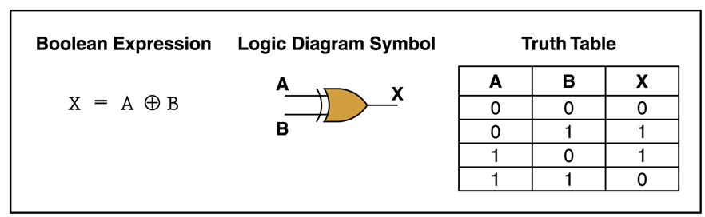

# tensorforce-xor
### Self contained [TensorForce](https://github.com/reinforceio/tensorforce) demo implementing a XOR logical gate

* **xor_model.py:** network/agent definition and setup parameters
* **xor_train.py:** train the network (500 episodes should be more than enough)
* **xor_eval.py:** run the trained network, inputs (X1 & X2) are binary values (0/1)

- - - -

